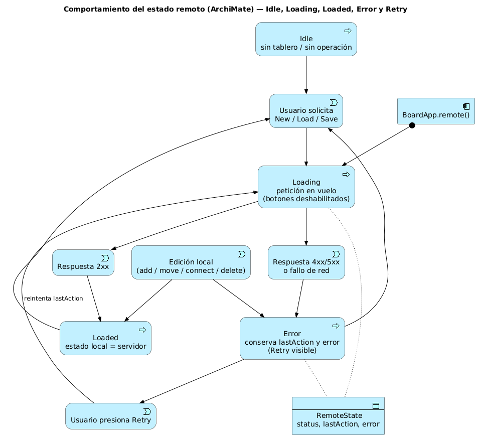
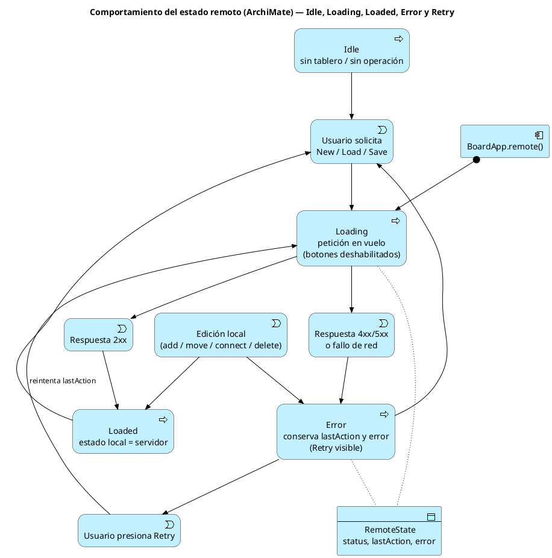

# Parte 2 — Modelo de estados: Idle, Loading, Loaded, Error y Retry

**Responsable:** Jhonatan David Madero
**Taller:** ARSW Semana 06 — Diseño del cliente web del Collaborative Board

## 2.1 Objetivo

Modelar el ciclo de vida de la comunicación con el servidor REST dentro del cliente, de forma que la interfaz siempre sepa en qué situación está y que la acción **Retry** tenga una semántica explícita.

## 2.2 Estados

| Estado | Significado | Qué ve el usuario | Acciones permitidas |
|---|---|---|---|
| **Idle** | No hay operación remota en curso y aún no se ha cargado ni creado un tablero (o el último resultado ya fue consumido). | Indicador "Idle", botones New y Load activos, Save deshabilitado si no hay `boardId`. | New, Load, edición local. |
| **Loading** | Hay una petición en vuelo (create, load o save). | Indicador "Loading…", mensaje `"<Acción>..."`, botones remotos deshabilitados, edición local bloqueada para evitar inconsistencia entre lo enviado y lo mostrado. | Ninguna acción remota; cancelar no está soportado. |
| **Loaded** | La última operación terminó bien y el estado local refleja lo que hay en el servidor. | Indicador "Loaded", mensaje `"<Acción> OK"`, todos los botones activos, botón Retry oculto. | New, Load, Save, edición local. |
| **Error** | La última operación falló. Se conserva la acción fallida (`lastAction`) y el error (`BoardApiError`). | Indicador "Error", mensaje con `error.message`, botón **Retry** visible. | Retry, New, Load, edición local. |

## 2.3 Diagrama de comportamiento (ArchiMate)

ArchiMate no tiene máquinas de estados como UML, por lo que el ciclo se modela en la **capa de aplicación** con *Application Processes* (uno por estado: Idle, Loading, Loaded, Error), *Application Events* (solicitud del usuario, respuesta 2xx, respuesta fallida, Retry, edición local) y relaciones *triggering*. El *Data Object* `RemoteState` es el que leen/escriben los procesos.



Fuente (PlantUML con la librería ArchiMate, `docs/architecture/archimate/03-remote-state-behavior.puml`):



## 2.4 Estructura del estado remoto en `BoardState`

```js
remote = {
  status: 'idle' | 'loading' | 'loaded' | 'error',
  lastAction: null | (() => Promise<Board>),   // acción que se puede reintentar
  error: null | { status, code, message }      // BoardApiError serializable
}
```

Decisión: el starter usa `'success'`; se renombra a `'loaded'` para alinearse con el enunciado del taller y con el indicador de UI.

## 2.5 Semántica de Retry

- **Qué reintenta:** exactamente la misma función `lastAction` que falló (cerrada sobre sus argumentos originales: nombre, id o tablero).
- **Cuándo está disponible:** solo en `Error` y solo si `lastAction != null`. En cualquier otro estado el botón está oculto.
- **Qué pasa al reintentar:** `Error → Loading → (Loaded | Error)`. Si falla otra vez, se conserva la misma `lastAction`, por lo que Retry sigue disponible.
- **Qué lo invalida:** iniciar cualquier otra acción remota reemplaza `lastAction`; la acción anterior deja de ser reintentable.
- **Caso Save con ediciones posteriores:** si el usuario edita localmente después de un Save fallido, Retry reenviaría el tablero *tal como estaba en el intento fallido*. Para evitar sorpresas, al editar en estado `Error` se limpia `lastAction` si esta era un Save; el usuario deberá presionar Save de nuevo. New y Load sí se conservan como reintentables porque no dependen del estado local.

## 2.6 Guardas en Loading

El TODO del starter (`prevent incompatible actions while loading/saving`) se resuelve en `BoardApp.remote()`:

```js
async function remote(label, action){
  if (state.snapshot().remote.status === 'loading') return; // guarda
  state.setRemote('loading', action, null); refresh(`${label}...`);
  try { const r = await action(); state.setRemote('loaded', null, null); refresh(`${label} OK`); return r; }
  catch (e) { state.setRemote('error', action, toSerializable(e)); refresh(); throw e; }
}
```

Además, en `refresh()` se deshabilitan los botones `New`, `Load`, `Save` y de la toolbar cuando `status === 'loading'`.

## 2.7 Mapeo de errores del API a la UI

| Origen | `BoardApiError` | Mensaje al usuario |
|---|---|---|
| `GET /api/boards/{id}` con id inexistente | `404 / BOARD_NOT_FOUND` | "No existe un tablero con ese id." |
| `PUT` con conector inválido | `400 / VALIDATION_ERROR` | "El tablero tiene un conector con origen o destino inválido." |
| Servidor caído / sin red | `0 / NETWORK_ERROR` | "No se pudo contactar al servidor. Reintenta." |
| Otro 5xx | `500 / HTTP_ERROR` | "Error del servidor. Reintenta más tarde." |
