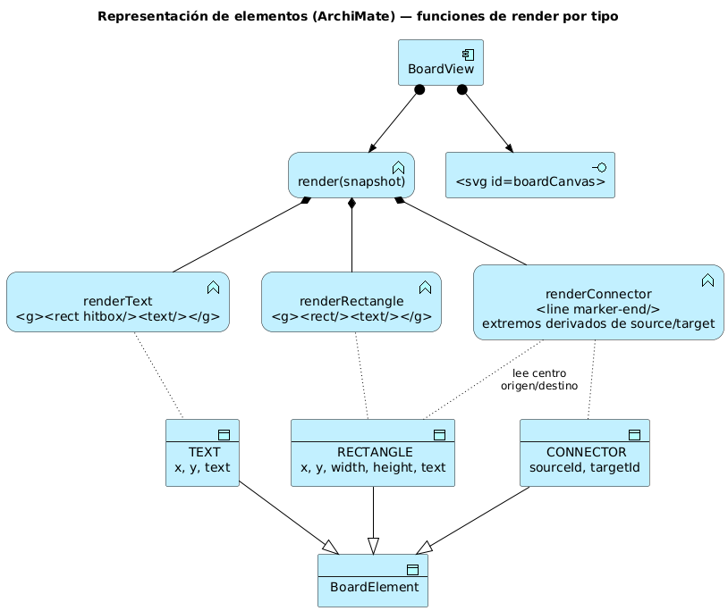
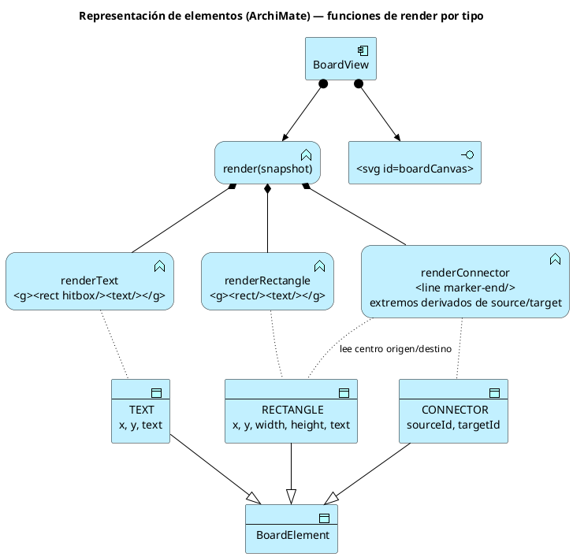

# Parte 3 — Representación de RECTANGLE, TEXT y CONNECTOR

**Responsable:** Juan Sebastián Murcia
**Taller:** ARSW Semana 06 — Diseño del cliente web del Collaborative Board

## 3.1 Objetivo

Definir cómo cada tipo de `BoardElement` se modela en el estado del cliente y cómo se proyecta en SVG, de manera que la vista sea una función pura del snapshot (`render(snapshot)`), sin guardar estado de negocio en el DOM.

## 3.2 Modelo unificado del elemento (contrato actual)

Todos los elementos comparten la misma forma (viene del `record BoardElement` del servidor):

```json
{ "id": "rect-…", "type": "RECTANGLE", "x": 100, "y": 90, "width": 170, "height": 70,
  "text": "Component", "sourceId": null, "targetId": null }
```

| Campo | RECTANGLE | TEXT | CONNECTOR |
|---|---|---|---|
| `x`, `y` | Esquina superior izquierda | Punto base del texto | Ignorados (0). La posición se **deriva** de origen y destino |
| `width`, `height` | Tamaño de la caja | Caja lógica para selección (150×30) | Ignorados (0) |
| `text` | Etiqueta centrada dentro de la caja | Contenido del texto | Vacío (reservado para etiqueta del enlace) |
| `sourceId`, `targetId` | `null` | `null` | **Obligatorios**, deben apuntar a elementos no-conector distintos |

## 3.3 Proyección a SVG

### RECTANGLE
```html
<g data-id="rect-1" class="shape">
  <rect x="100" y="90" width="170" height="70" rx="8" class="rect [selected]"/>
  <text x="185" y="125" text-anchor="middle" dominant-baseline="middle" class="label">Component</text>
</g>
```
- Se envuelve en `<g data-id>` para que un solo clic seleccione caja y etiqueta.
- El estilo (fill, stroke, resaltado de selección) va en `app.css`, no inline, para que la vista solo decida *qué* dibujar.

### TEXT
```html
<g data-id="text-1" class="shape">
  <rect x="120" y="210" width="150" height="30" class="hitbox"/>   <!-- transparente -->
  <text x="120" y="230" class="label text [selected]">Text</text>
</g>
```
- Se agrega un `<rect>` transparente (hitbox) para que el arrastre y la selección funcionen aunque el usuario haga clic en un espacio entre letras.

### CONNECTOR
```html
<line x1="185" y1="125" x2="500" y2="330" data-id="conn-1"
      class="connector [selected]" marker-end="url(#arrow)"/>
```
- Los extremos se calculan en render con `center(source)` y `center(target)`; el conector **no guarda coordenadas propias**.
- Se dibuja **antes** que las figuras para que quede debajo de ellas.
- Se define un `<marker id="arrow">` en `<defs>` para la punta de flecha.
- Si `sourceId` o `targetId` no existen en el snapshot, el conector se omite (defensa ante datos inconsistentes) y se registra un warning en consola.

## 3.4 Orden de dibujo y selección

1. `<defs>` (marcadores).
2. Todos los `CONNECTOR`.
3. Todos los `RECTANGLE` y `TEXT` en el orden del arreglo `elements` (los últimos quedan encima).

La selección se representa solo con la clase CSS `selected`; el id seleccionado vive en `snapshot.selectedId`, nunca en un atributo del DOM que la vista tenga que leer después.

## 3.5 Interacción por tipo

| Gesto | RECTANGLE / TEXT | CONNECTOR |
|---|---|---|
| `pointerdown` | Emite `select(id)` y, si hay conector en construcción, `connectTarget(id)`. Inicia drag. | Emite `select(id)`. No inicia drag ni puede ser destino de conexión. |
| `pointermove` | Emite `move(id, x, y)` con coordenadas transformadas al `viewBox`. | Ignorado. |
| Delete | Borra el elemento y todos los conectores que lo referencian. | Borra solo el conector. |

Mejora sobre el starter: el drag debe usar el **offset** entre el punto de clic y la esquina del elemento, para que la figura no "salte" al puntero. El offset se guarda en la variable local `drag` de la vista, ya que es estado de gesto (efímero), no de negocio.

## 3.6 Diagrama de representación (ArchiMate)

`BoardView` se modela como *Application Component* al que se le asigna la *Application Function* `render(snapshot)`, compuesta por una función de render por tipo. Cada tipo de elemento es un *Data Object* que especializa a `BoardElement`; `renderConnector` además accede a los rectángulos/textos de origen y destino para calcular los extremos.



Fuente (`docs/architecture/archimate/04-element-rendering.puml`):



En código se implementa como un mapa `renderers[type]` dentro de `board-view.js`, para que agregar un cuarto tipo (por ejemplo `ELLIPSE` en labs futuros) no requiera tocar el bucle principal de `render`.
