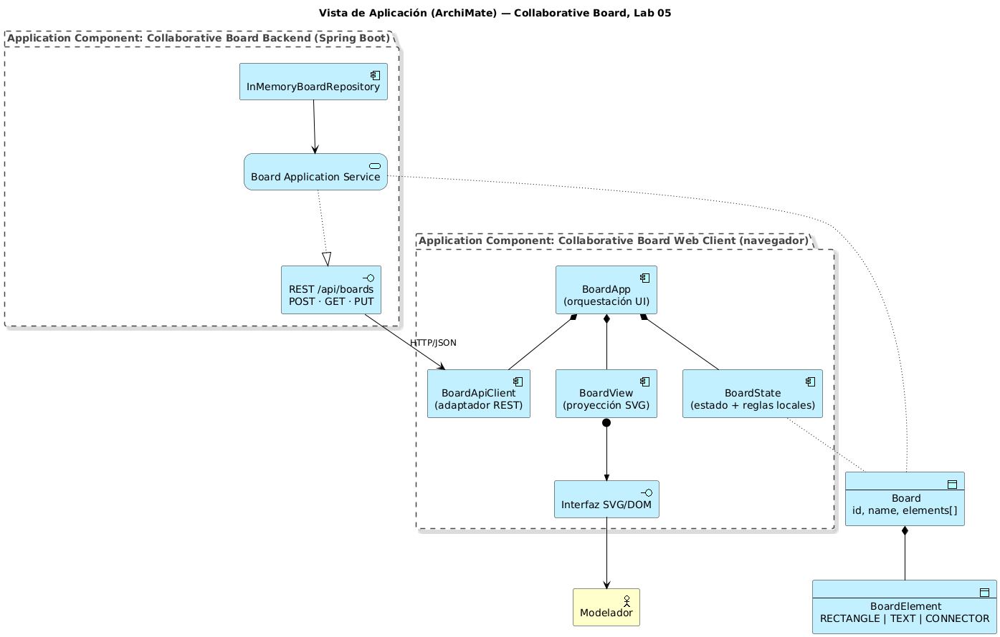
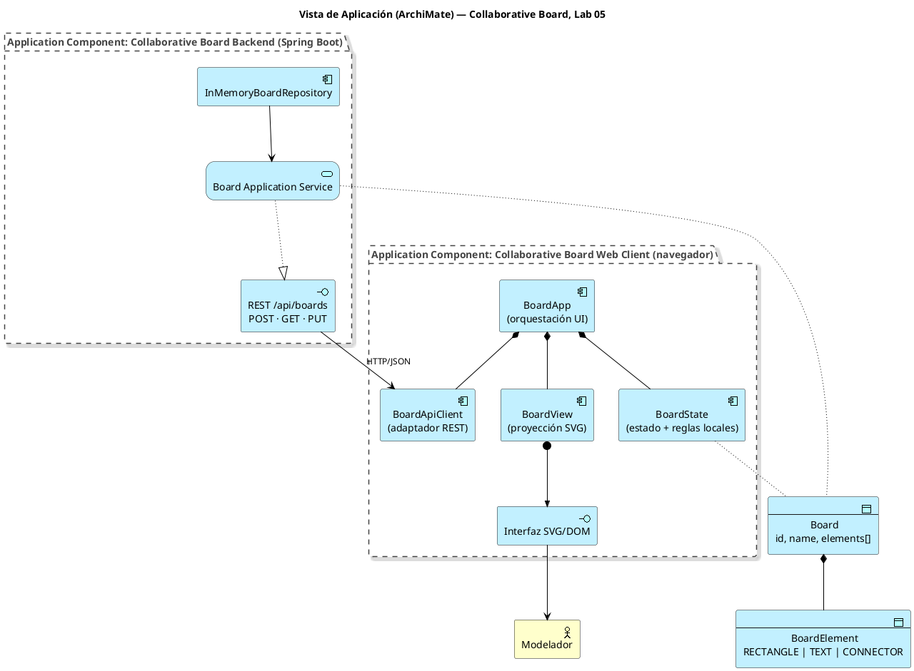
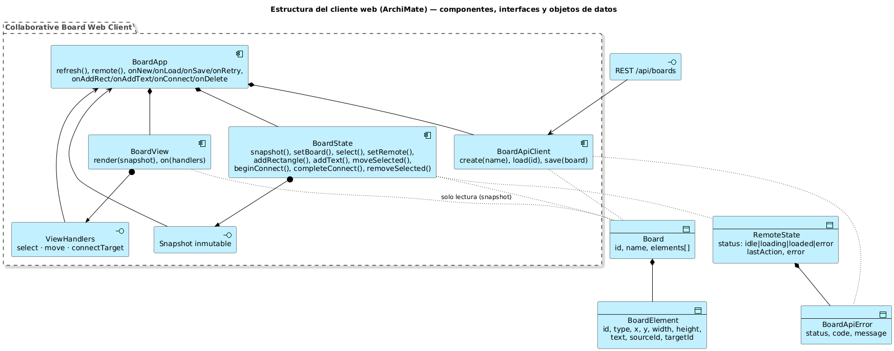
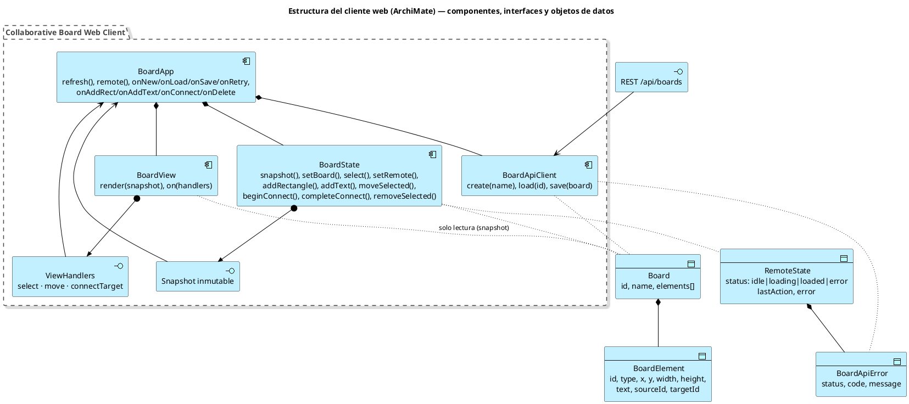

# Parte 5 — Vista de Aplicación y estructura del cliente (ArchiMate)

**Responsable:** Juan Sebastián Murcia
**Taller:** ARSW Semana 06 — Diseño del cliente web del Collaborative Board

## 5.1 Vista de Aplicación (ArchiMate — capa de aplicación)

Elementos usados: *Business Actor*, *Application Component*, *Application Interface*, *Application Service*, *Data Object* y relaciones *composition*, *assignment*, *serving*, *realization* y *access*.

Fuente (`docs/architecture/archimate/01-application-view.puml`):

**Lectura de la vista**

- El cliente web es un único *Application Component* compuesto por cuatro subcomponentes; solo `BoardApiClient` cruza la frontera del navegador.
- La *Application Interface* `REST /api/boards` es el único punto de acoplamiento entre cliente y servidor; en el Lab 06 se agregará una segunda interfaz (`STOMP /topic/boards/{id}`) sin modificar `BoardView` ni `BoardState`.
- `Board` y `BoardElement` son los *Data Objects* compartidos; el contrato JSON es la representación de intercambio.

> Los cuatro diagramas se renderizan con `java -jar plantuml.jar -tpng docs/architecture/archimate/*.puml`. Si se requiere el modelo en Archi, los mismos elementos y relaciones se replican allí.

## 5.2 Diagrama de estructura del cliente (ArchiMate)

El equivalente al diagrama de clases se expresa en ArchiMate: cada módulo JS es un *Application Component* (con sus operaciones listadas en el nombre), las fronteras entre módulos son *Application Interfaces* (`ViewHandlers`, `Snapshot inmutable`, `REST /api/boards`) y las estructuras de datos son *Data Objects* (`Board`, `BoardElement`, `RemoteState`, `BoardApiError`).

Fuente (`docs/architecture/archimate/02-client-structure.puml`):

## 5.3 Trazabilidad diagrama ↔ código

| Elemento del diagrama | Archivo real |
|---|---|
| `BoardApp` | `src/main/resources/static/js/app.js` |
| `BoardState`, `RemoteState` | `src/main/resources/static/js/state/board-state.js` |
| `BoardApiClient`, `BoardApiError` | `src/main/resources/static/js/api/board-api-client.js` |
| `BoardView`, `ViewHandlers` | `src/main/resources/static/js/ui/board-view.js` |
| `Board`, `BoardElement` (cliente) | Objetos JSON planos; espejo de `domain/model/Board.java` y `BoardElement.java` |
| Interfaz REST | `infrastructure/web/rest/BoardRestController.java` |

## 5.4 Cambios respecto al diagrama del Lab 04

- Se agrega toda la rama del cliente (antes solo existía el backend).
- `BoardElement` gana el valor `CONNECTOR` y los atributos `sourceId`/`targetId`.
- Se introduce `RemoteState` como estructura explícita para los estados Idle/Loading/Loaded/Error y el `lastAction` de Retry.
